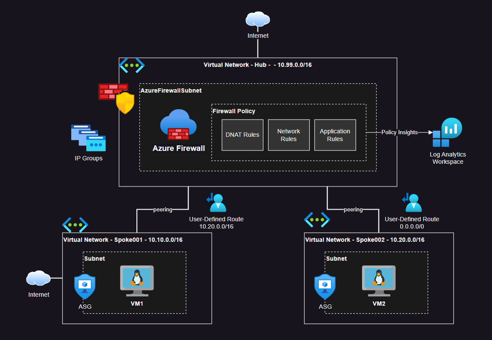

# Azure Firewall

Hub-spoke topology with Azure Firewall.



## Setup

Copy the `.auto.tfvars` from the template:

```sh
cp config/sample.tfvars .auto.tfvars
```

Get your public IP address and add it to the `home_ips` variable. This will be used for `DNAT`:

```sh
dig +short myip.opendns.com @resolver1.opendns.com
```

Create the infrastructure:

```sh
terraform init
terraform apply -auto-approve
```

Check the policy rules to interact with the solution components.

Threat intelligence will be executed first in the policy lifecycle.

Firewall policy rule types will be processed in the following order:

1. DNAT
2. Network
3. Application

---

### Clean-up

```sh
terraform destroy -auto-approve
```
